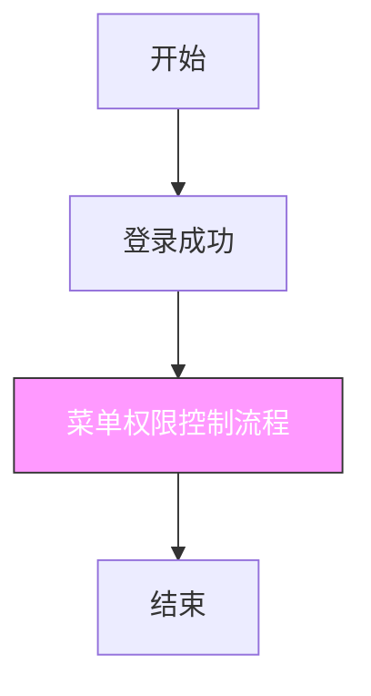
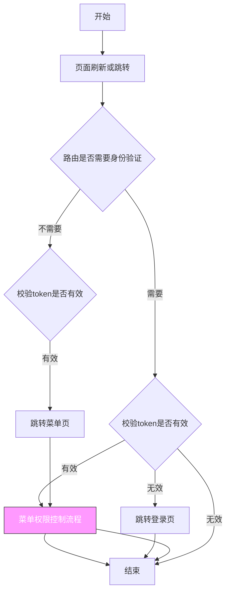
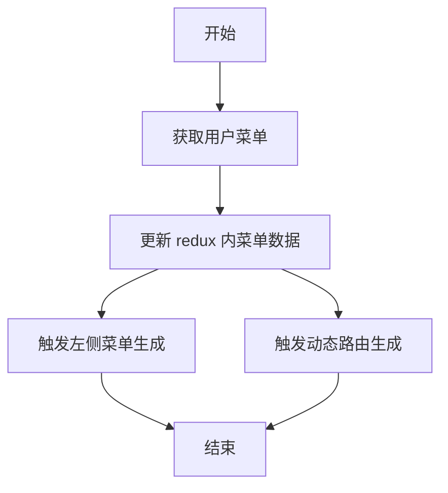
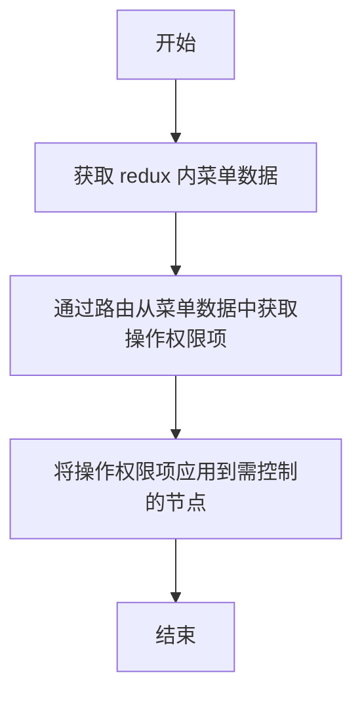

## 登录流程



## 页面刷新|跳转流程



## 菜单权限控制流程



## 操作权限控制流程



```tsx
import { useAuth, operateAuthValueToDisabled } from '@/utils/useAuth'

const Page: React.FC = () => {
  const { operateAuth } = useAuth()

  return (
    <div>
      <button disabled={operateAuthValueToDisabled(operateAuth.add)}>add</button>
      <button disabled={operateAuthValueToDisabled(operateAuth.edit)}>edit</button>
      <button disabled={operateAuthValueToDisabled(operateAuth.delete)}>delete</button>
      <button disabled={operateAuthValueToDisabled(operateAuth.detail)}>detail</button>
    </div>
  )
}

export default Page
```
